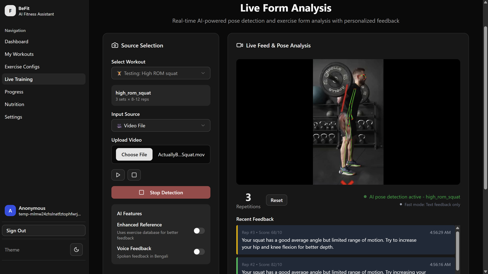
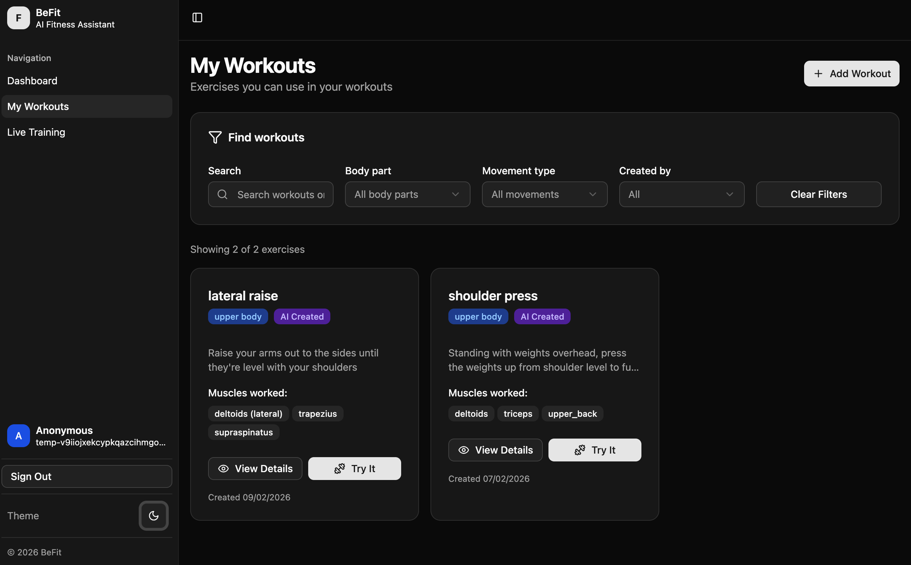

# BeFit

**BeFit** is an intelligent AI-powered workout assistant that combines **Agentic AI**, **RAG-enhanced knowledge**, and **MediaPipe pose detection** to create personalized workout routines and provide real-time form correction — designed for fitness enthusiasts at every level.

---

## 🚀 Core Features

### 🧠 **Agentic AI Workflow**
- **Intelligent Chat Assistant**: Natural language conversation for fitness advice and workout creation
- **Tool-Based Execution**: Uses specialized tools for workout generation, exercise config creation, and data persistence
- **Context-Aware Responses**: Maintains conversation flow with multi-step reasoning
- **User Session Management**: Personalized experience with login/logout functionality

### 🎯 **Dynamic Workout Generation**
- **Personalized Routines**: AI creates workouts based on goals, equipment, experience level, and duration
- **Unlimited Exercise Support**: No longer limited to predefined exercises - AI generates tracking configs for any exercise
- **Automatic Exercise Config Generation**: MediaPipe pose tracking configurations created dynamically using LLM analysis
- **Smart Caching**: Efficient reuse of generated configurations for performance
- **Database Integration**: Saves workouts with linked exercise configurations for future use

### 📚 **RAG-Enhanced Knowledge System**
- **Vector Database**: Qdrant-powered embedding storage of exercise science research
- **Relevance Filtering**: Only uses high-relevance content (70%+ similarity) for responses
- **Evidence-Based Recommendations**: Leverages latest research in biomechanics, anatomy, and exercise science
- **Source Citation**: References specific research sources in responses
- **OpenRouter Integration**: Cloud-based LLM and embedding generation via OpenRouter API

### 📷 **Advanced Pose Detection & Analysis**
- **MediaPipe Integration**: Real-time pose landmark detection via webcam
- **Multi-Joint Tracking**: Composite angle analysis from multiple body joints
- **Adaptive Peak Detection**: Intelligent rep counting with trend analysis
- **Target Angle Guidance**: ROM (Range of Motion) optimization with personalized targets
- **Bilateral Tracking**: Left and right side angle measurements for balanced analysis

### ✅ **Intelligent Real-Time Feedback**
- **AI-Powered Analysis**: LLM-based feedback generation considering form, tempo, and ROM
- **Configurable Performance Modes**:
  - **Fast Mode**: Quick text feedback for immediate responsiveness
  - **Enhanced Reference**: RAG-enhanced feedback with research backing
  - **Voice Feedback**: Spoken guidance in Bengali for hands-free operation
  - **Combined Mode**: Both enhanced reference and voice for comprehensive feedback
- **Scoring System**: 0-100 performance scores with "good/okay/bad" classifications
- **Progressive ROM Targets**: Adjustable range of motion goals (Low/Standard/High/Maximum)

### 🛠️ **User Interface & Experience**
- **Modern SvelteKit Frontend**: Built with shadcn/ui components for a clean, responsive design
- **Dashboard Overview**: Centralized view of workouts, progress, and AI interactions
- **Exercise Config Management**: Visual interface for viewing and testing generated configurations
- **Form Analysis Page**: Real-time pose detection with visual feedback
- **Workout Library**: Save, organize, and access personalized workout routines
- **Mobile-Responsive**: Works seamlessly across desktop and mobile devices

---

## 🤖 Agentic AI Workflow

BeFit implements a sophisticated agentic AI system that orchestrates multiple tools and knowledge sources to provide comprehensive fitness assistance:

### Agentic Components:

1. **Query Analysis Agent**: Determines if queries are fitness-related and routes appropriately
2. **RAG Retrieval Agent**: Searches vector database for relevant exercise science research
3. **Workout Generation Agent**: Creates personalized routines using evidence-based principles
4. **Exercise Config Agent**: Generates MediaPipe configurations for any exercise dynamically
5. **Persistence Agent**: Manages user data, workout storage, and exercise configurations
6. **Feedback Agent**: Provides real-time form analysis using pose detection data

---

## 🛠️ Tech Stack

### **Frontend & UI**
- **SvelteKit**: Modern web framework with server-side rendering
- **shadcn/ui**: Beautiful, accessible component library built on Radix UI
- **Tailwind CSS**: Utility-first CSS framework for rapid styling
- **TypeScript**: Type-safe development with enhanced developer experience

### **AI & Machine Learning**
- **Vercel AI SDK**: Agentic framework for tool-based AI interactions with streaming support
- **OpenRouter**: Unified API for accessing multiple LLM providers (OpenAI, Anthropic, Qwen, etc.)
- **MediaPipe**: Google's pose detection and landmark tracking for real-time form analysis
- **OpenAI-Compatible API**: Flexible model integration

### **Observability & Monitoring**
- **Opik (Comet)**: LLM observability platform for tracing, monitoring, and debugging AI calls
  - **Purpose**: Track all LLM interactions (chat, feedback, exercise config generation)
  - **Features**: Monitor token usage, latency, tool calls, and conversation flows
  - **Integration**: Automatic tracing via OpenTelemetry with OpikExporter
  - **Benefits**: Debug AI responses, optimize costs, and evaluate model performance

### **Data & Storage**
- **PostgreSQL**: Primary database via Prisma ORM for workouts, exercises, and user data
- **Qdrant**: Vector database for RAG embeddings and semantic search
- **Prisma**: Type-safe database client and migration tool
- **Better Auth**: Secure authentication and session management

### **Infrastructure**
- **SvelteKit API Routes**: Backend API endpoints for chat, feedback, and exercise configs
- **Docker**: Containerized Qdrant deployment
- **OpenTelemetry**: Distributed tracing for LLM observability

---

## 🔍 How It Works

### **Workout Creation Flow**
1. **User Input** → Express fitness goals, available equipment, and experience level
2. **AI Analysis** → Agent analyzes requirements and queries RAG system for evidence-based recommendations
3. **Workout Generation** → AI crafts personalized plan with exercises, sets, reps, and rest periods
4. **Exercise Config Creation** → Automatically generates MediaPipe tracking configurations for each exercise
5. **Database Storage** → Saves complete workout with linked exercise configurations
6. **Real-Time Tracking** → Use saved workouts for live pose detection and form feedback

---

## 🌟 Acknowledgments

- **Comet ML (Opik)**: For powerful LLM observability and monitoring capabilities
- **MediaPipe Team**: For excellent pose detection technology
- **Fitness Community**: Feedback and testing from real users and trainers

---

*Built with ❤️ for the fitness community. Transform your workouts with AI-powered intelligence.*
